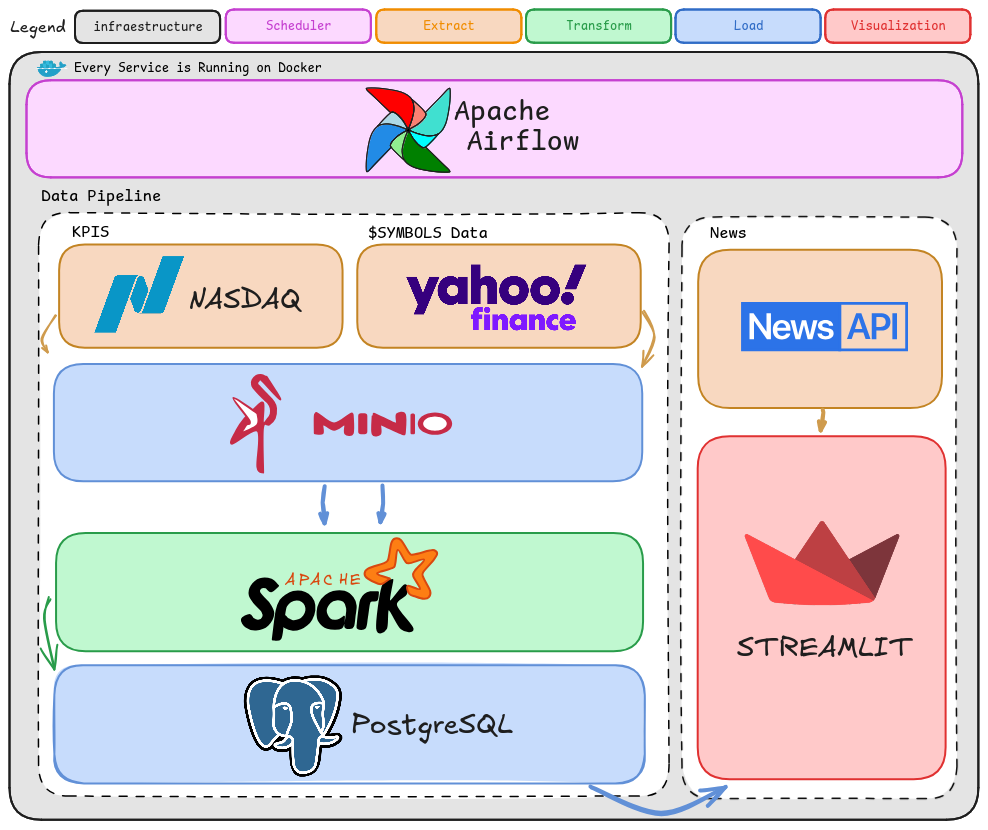

<h1 align="center">Nasdaq Vision</h1>

## Descripcion

Este repositorio contiene un proyecto personal

Se centra en el desarrollo de una pipeline que extrae, transforma y carga datos desde y hacia diversas fuentes.

Además, incluye la creación de un dashboard con visualizaciones utilizando Streamlit.

---
## Infraestructura
### Herramientas y Servicios
      

---
## Diagrama del Pipeline

---

## Data Pipeline

#### ETL Orquestado y automatizado con [Airflow](https://airflow.apache.org/)
- Extracción [NASDAQ](https://www.nasdaq.com/): Obtiene datos base de símbolos bursátiles
- Extracción Histórica: Obtiene información histórica de cada símbolo usando la API de [YFinance](https://finance.yahoo.com/)
- Procesamiento: Limpia y carga los datos en nuestro Datawarehouse

#### Visualización con [Streamlit](https://streamlit.io/)
- Dashboard conectado a nuestra base [PostgreSQL](https://www.postgresql.org/)
- Integración con [NewsAPI](https://newsapi.org/)
- Visualización de datos históricos, noticias y mas.

---
